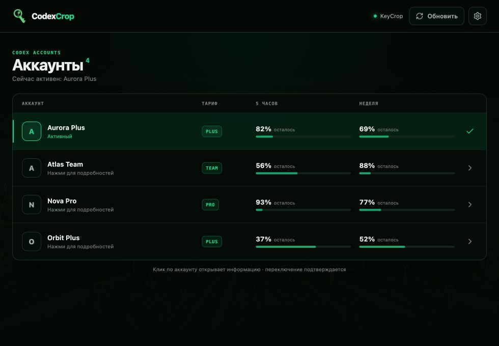
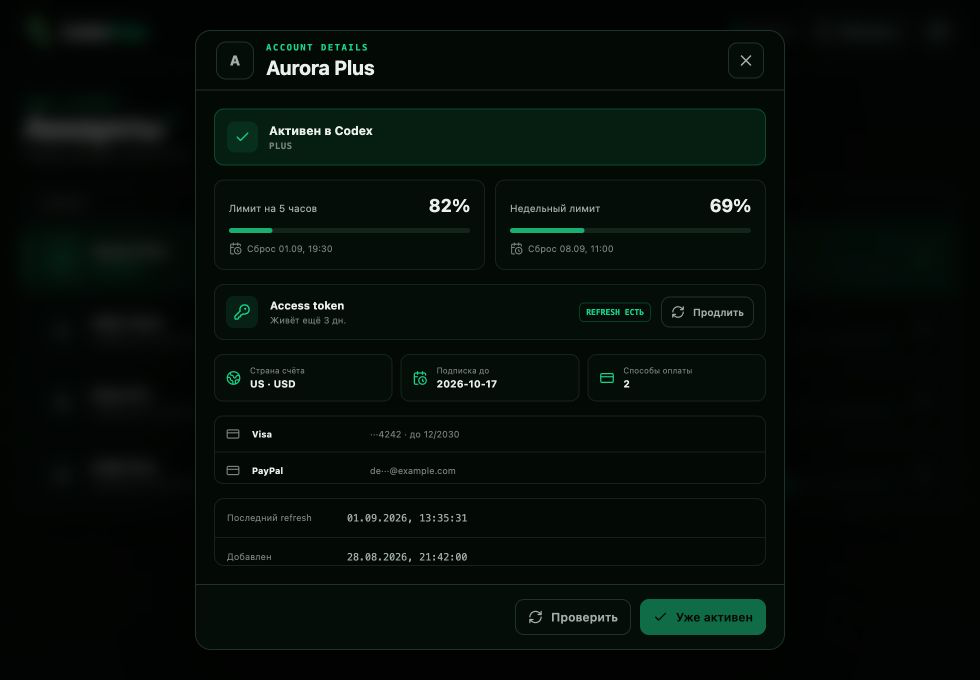

# Codex Account Switcher

Кроссплатформенный менеджер аккаунтов Codex на Tauri 2. Импортирует купленные аккаунты из KeyCrop, проверяет доступные лимиты и безопасно переключает локальный `~/.codex/auth.json`.

**[Devlog разработки](DEVLOG.md)** · текущая версия: **2.2.2**

> Проект не связан с OpenAI или KeyCrop. Интеграция KeyCrop неофициальная и может перестать работать при изменении API сайта.

## Интерфейс





## Возможности

- единый список аккаунтов с тарифом и остатком лимитов на 5 часов и неделю;
- переключение активного аккаунта с предварительным просмотром подробностей;
- импорт `auth.json` из покупок KeyCrop;
- поддержка обычного Cookie header и JSON-экспорта EditThisCookie / Cookie-Editor;
- автоматический обход всех страниц `/api/account/purchases`;
- удаление дубликатов по идентификатору аккаунта;
- автоматическое удаление профилей с подтверждённо истёкшей авторизацией;
- проверка каждого профиля в изолированном `CODEX_HOME`;
- одноразовая ротация refresh token при импорте нового аккаунта;
- ручное продление токенов с резервной копией предыдущей пары;
- локальный Refresh Broker против ложного выхода из Codex;
- перехват ротации access/refresh-токенов и сохранение свежей авторизации в активный профиль;
- расширенная карточка: срок access token, подписка, страна счёта и замаскированные способы оплаты;
- резервная копия текущего `auth.json` перед переключением.

## Как это работает

1. Пользователь один раз вставляет cookies своей сессии KeyCrop.
2. Rust-бэкенд проверяет сессию через `GET /api/auth/me`.
3. Покупки загружаются постранично через `GET /api/account/purchases?page=N&limit=8`.
4. Валидные данные Codex извлекаются из ответа и сохраняются как локальные профили.
5. Перед сохранением нового профиля refresh token один раз обменивается через официальный OAuth endpoint. Нерабочая или уже использованная цепочка отклоняется сразу.
6. Для проверки лимитов приложение запускает `codex app-server` с отдельным каталогом `CODEX_HOME`.
7. При переключении выбранный профиль атомарно записывается в `~/.codex/auth.json`.

Сырые ответы KeyCrop, cookies и токены не отправляются во frontend и не выводятся в логи.

## Безопасность и хранение данных

- KeyCrop cookie хранится в системном хранилище секретов:
  - macOS — Keychain;
  - Windows — Credential Manager;
  - Linux — Secret Service;
- профили находятся в `~/.codex/account-switcher/profiles`;
- резервные копии находятся в `~/.codex/account-switcher/backups`;
- файлы на Unix создаются с правами `0600`, каталоги — `0700`;
- обновлённый токен записывается обратно только при совпадении идентификатора аккаунта;
- профиль удаляется автоматически только при явной ошибке истёкшей авторизации. Сетевой сбой удаление не вызывает.

## Refresh Broker

Broker слушает только `127.0.0.1:1456` и не принимает подключения извне. Пока access token ещё действителен, он возвращает текущую пару и не запускает лишнюю ротацию. После истечения access token запрос передаётся OAuth-серверу, а свежая пара атомарно сохраняется в `auth.json` и активный профиль.

Откройте настройки, нажмите **Подключить** в разделе Refresh Broker, затем полностью перезапустите Codex. Switcher должен оставаться запущенным, пока используется broker.

Никогда не добавляйте в репозиторий собственные cookies, `auth.json`, содержимое каталога `~/.codex/account-switcher` или сборки с пользовательскими данными.

## Требования

- [Node.js](https://nodejs.org/) 18+;
- [Rust](https://www.rust-lang.org/tools/install) stable;
- системные зависимости [Tauri 2](https://v2.tauri.app/start/prerequisites/);
- установленный и доступный в `PATH` Codex CLI.

## Запуск для разработки

```bash
npm install
npm run tauri dev
```

Обычный `npm run dev` запускает только Vite-интерфейс без Tauri-бэкенда. Для полноценной работы используйте `npm run tauri dev`.

## Проверка

```bash
npm run build
cargo test --manifest-path src-tauri/Cargo.toml
cargo fmt --manifest-path src-tauri/Cargo.toml --check
```

## Сборка установщика

```bash
npm run tauri build
```

Установщик собирается на целевой операционной системе:

- macOS: `.app` и `.dmg`;
- Windows: `.msi` или `.exe`;
- Linux: `.deb`, `.rpm` или `.AppImage` — в зависимости от установленного toolchain.

Сейчас приложение проверено на macOS Apple Silicon. Код и зависимости подготовлены для Windows и Linux, но релизные сборки для этих платформ ещё требуют отдельного тестирования.

## Структура проекта

```text
src/                       React-интерфейс
src-tauri/src/lib.rs       Tauri-команды, KeyCrop API и работа с профилями
src-tauri/capabilities/    разрешения приложения
src-tauri/icons/           иконки установщиков
```

## Ограничения

- приложению нужен локально установленный Codex CLI;
- изменение формата `auth.json`, протокола `codex app-server` или API KeyCrop может потребовать обновления;
- cookies дают доступ к аккаунту KeyCrop — импортируйте их только на своём устройстве и не публикуйте в issues или логах.
